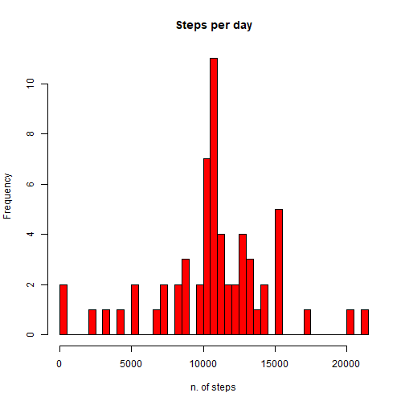

## Loading and preprocessing the data


```r
data <- read.csv("./activity.csv") #Read the data               
data$date <- as.Date(data$date, "%Y-%m-%d") #set the data in data format

Sys.setlocale("LC_TIME", "English") #change the language of the locale to English
```

```
## [1] "English_United States.1252"
```
## What is mean and median total number of steps taken per day?


```r
stepsperday <- tapply(data$steps, data$date, FUN = sum) #calculates the sum of steps per date
hist(stepsperday, col = "blue", main = "Steps per day", xlab= "n. of steps", breaks = 40) #an histogram with the frequency of steps per day
```


```r
meanstepsperday <- mean(as.numeric(stepsperday), na.rm = TRUE) #mean steps per day
medianstepsperday <- median(as.numeric(stepsperday), na.rm = TRUE) #median steps per day
```

The median step per day is 1.0766189 &times; 10<sup>4</sup>. The median step per day is 1.0765 &times; 10<sup>4</sup>.

## What is the average daily activity pattern?


```r
takemean <- function(x) {
        mean(x, na.rm=TRUE)
}  #a simple function that calculates the mean

stepsperinterval <- aggregate(x = data$steps, by= list(data$interval), FUN = takemean) # aggregate the dataset by taking the mean by interval 
colnames(stepsperinterval) <- c("interval", "avg_steps") #rename columns

plot(stepsperinterval$interval, stepsperinterval$avg_steps, type = "l", xlab = "interval", ylab="average steps") #a time series plot w/ mean steps on the y-axis and the intervals on the x-axis
```


```r
max_avg_steps <- stepsperinterval[stepsperinterval$avg_steps == max(stepsperinterval$avg_steps),] #take the interval with the maximum n of steps
max_interval <- max_avg_steps$interval
```

The interval with the maximum average n.of steps is 835.

## Imputing missing values


```r
count_na_byrows <- sum(rowSums(is.na(data)) > 0) #counts the n. rows with a na
data_without_missing <- data
for (i in which(is.na(data_without_missing[, "steps"]))) {
        data_without_missing[i, "steps"] <- mean(data_without_missing[data_without_missing[, "interval"] == data_without_missing[i, "interval"], "steps" ], na.rm=TRUE)
        }  # creates a new dataset where the NA are substituted with the average n of steps in that particular interval

stepsperday_nomissing <- tapply(data_without_missing$steps, data_without_missing$date, FUN = sum) #a vector containing the number of steps taken each day
hist(stepsperday_nomissing, col = "red", main = "Steps per day", xlab= "n. of steps", breaks = 40) #histogram for the total number of steps taken each day
```



```r
meanstepsperday_nomissing <- mean(as.numeric(stepsperday_nomissing)) #mean of steps taken each day
medianstepsperday_nomissing <- median(as.numeric(stepsperday_nomissing)) #median of steps taken each day
```

I have changes NAs with the avegerage steps per interval. When NAs are filled with these values, the mean steps per day is 1.0766189 &times; 10<sup>4</sup> and the median is 1.0766189 &times; 10<sup>4</sup>. Compared to the dataset with the missing values, the mean does not change, while the median increases.

## Are there differences in activity patterns between weekdays and weekends?


```r
data_without_missing$weekdays <- weekdays(data_without_missing$date) #add a column with the name of the day

## change the previous column by only specifying if it is a weekday or it is weekend
weekend <- c("Saturday", "Sunday")
for (i in weekend) {
        data_without_missing[data_without_missing$weekdays == i, "weekdays"] <- "weekend"
} 


#create a new variable with the average value of steps taken per interval in the weekdays and in the weekend.

data_without_missing[data_without_missing$weekdays != "weekend", "weekdays"] <- "weekday"


data_without_missing$avg_steps <- NA
for (i in unique(data_without_missing$interval)) {
        data_without_missing[data_without_missing$weekdays == "weekend" & data_without_missing$interval==i,]$avg_steps <- 
                mean(data_without_missing[data_without_missing$weekdays== "weekend" & data_without_missing$interval==i,]$steps)
}


for (i in unique(data_without_missing$interval)) {
        data_without_missing[data_without_missing$weekdays == "weekday" & data_without_missing$interval==i,]$avg_steps <- 
                mean(data_without_missing[data_without_missing$weekdays== "weekday" & data_without_missing$interval==i,]$steps)
}

#create a time series plot with two panels, one that shows the average steps per interval in the weekend and in the weekdays. 

library(lattice)
xyplot(avg_steps ~ interval| weekdays, data=data_without_missing, type= "l", layout= c(1,2))
```


